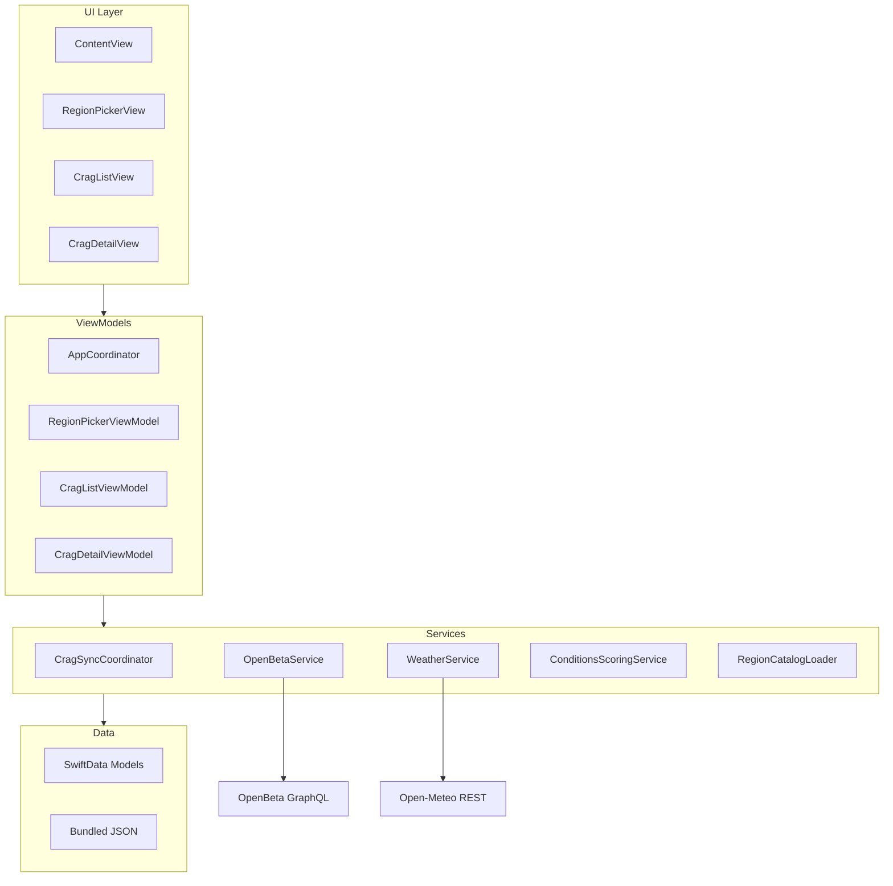
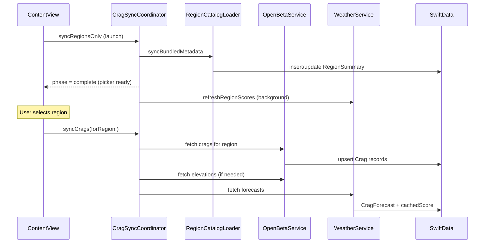

# CragWeather Architecture

## Layer Overview

| Layer | Responsibility |
|-------|----------------|
| **Views** | SwiftUI screens, navigation, search, filters |
| **ViewModels** | Presentation state, sorting/filtering, sync triggers |
| **Services** | API clients, scoring, sync orchestration |
| **Data** | SwiftData persistence + bundled `ColoradoRegions.json` |

## Sync Pipeline

### Launch flow (`syncRegionsOnly`)

1. Purge boulder-only crags from the store.
2. Seed or refresh region metadata from bundled JSON.
3. Set sync phase to `.complete` so the region picker is usable immediately.
4. Refresh region scores and metadata in the background (non-blocking).

### Post-selection flow (`syncCrags`)

1. Purge boulder crags for the selected region.
2. Fetch crags from OpenBeta if none are cached locally.
3. Refresh weather forecasts and compute condition scores.
4. Update region crag counts and sync timestamps.

## Region-First Launch

`AppCoordinator` keeps `selectedRegion` **session-only** — every cold launch starts on the region picker even though the last choice is still written to `UserDefaults` for other uses.

`ContentView` branches on `hasSelectedRegion`: picker vs. tabbed crag/favorites experience.

## Picker Eligibility

`RegionSummary.isEligibleForPicker`:

- **Show** if `cragCount > 0`, or the region has never been crag-synced (`lastCragSyncDate == nil`).
- **Hide** if sync completed and zero roped-eligible crags were found.

This keeps empty regions (e.g. boulder-only areas with no sport/trad) out of the list after sync.

## Scoring Pipeline

`ConditionsScoringService.score` combines:

| Factor | Weight |
|--------|--------|
| Temperature | 40% |
| Wind | 25% |
| Precipitation (rock-type sensitivity) | 25% |
| Cloud cover | 10% |

Aspect adds a seasonal sun-exposure bonus (up to +10 points). Results are clamped to 0–100 and stored on `CragForecast.conditionsScore` and `Crag.cachedScore`.

## Key Files

| File | Role |
|------|------|
| `ContentView.swift` | Root navigation, launch sync task |
| `AppCoordinator.swift` | Session region selection |
| `CragSyncCoordinator.swift` | Sync orchestration |
| `RegionCatalogLoader.swift` | Bundled region catalog |
| `ConditionsScoringService.swift` | Forecast scoring |
| `RegionSummary.swift` | Picker eligibility rules |
